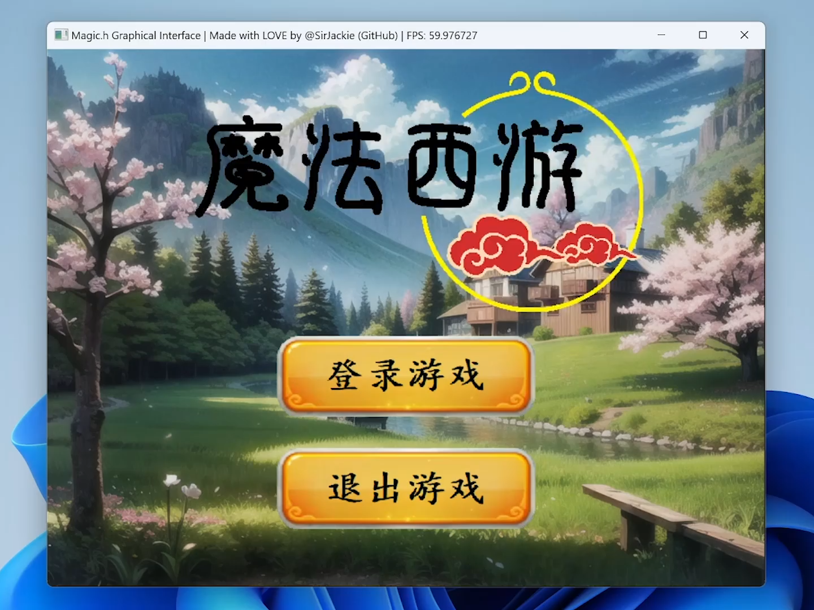

# MagicXiyou 魔法西游

一款回合制战斗游戏的Demo示例程序，用于演示Magic.h图形框架的性能和可能性。

目前实现了如下特性：

- 开始界面：按钮Hover效果，Logo图标的非线性缩放动画
- 地图界面：2.5D正交投影的地图场景，实现人物自由移动，实现人物帧动画
- 战斗场景：战斗特效，魔法特效，非线性动画，血量扣除，文字提示信息渲染

```
---------- 注意！----------
下载后双击 MagicXiyou.vcxproj 打开项目工程文件，
编译时，必须使用 ** Release x64 ** 配置进行编译，否则帧率无法达到最佳！切记！
```

## Demo 效果演示

点击如下图片或 [此链接](README.assets/MagicXiyou_Demo_v1.0.0.mp4)，即可播放Demo视频：

[](README.assets/MagicXiyou_Demo_v1.0.0.mp4)

或者直接播放视频（部分情况不支持）：

<video src="README.assets/MagicXiyou_Demo_v1.0.0.mp4"></video>
## License 开源声明

### 程序主体：完全开源

本软件由 @SirJackie 开发，依据 Mulan PSL v2 进行开源，授予您永久性的、全球性的、免费的、非独占的、不可撤销的版权许可。您可以复制、使用、修改、分发该软件，不论修改与否。

协议内容详见本目录下“LICENSE”文件。

### Logo 设计：有限使用

本声明中所提及的 “Logo”，特指软件开始界面中呈现的 “魔法西游” 素材图案。

Logo 的文字部分由 @SirJackie 使用数位板手写绘制，图形部分由 @SirJackie 聘请专业设计师进行设计，且已明确约定该图形部分的著作权归 @SirJackie 所有。因此，“魔法西游” Logo 的整体著作权由 @SirJackie 享有。

@SirJackie 授予您有限的权利，允许您在以下严格限定的条件下对 “魔法西游” Logo 素材图案进行复制、使用、修改及分发：

- **复制与使用**：仅可将该 Logo 素材图案用于本软件及其后续改进版本中，且不得对其进行任何形式的歪曲、篡改或其他损害其完整性的操作。
- **修改**：若您对 Logo 素材图案进行修改，修改后的版本必须明显区别于原始版本，且需在相关文档或说明中明确标注原始 Logo 的著作权归属 @SirJackie 。同时，修改后的 Logo 仅能继续用于本软件及其改进版本，不得用于其他任何用途。
- **分发**：您可以随本软件及其改进版本一同分发该 Logo 素材图案，但不得单独将其作为独立素材进行分发，且分发范围应与本软件及其改进版本的授权分发范围一致。

未经 @SirJackie 书面许可，任何超出上述授权范围的使用、复制、修改、分发等行为均构成对 @SirJackie 著作权的侵权，@SirJackie 将依法追究侵权人的法律责任。本法律声明适用法律。如双方就本声明或其相关事项发生争议，应首先通过友好协商解决；协商不成的，任何一方均有权向有管辖权的法院或仲裁机构提起诉讼或申请仲裁。

### 图形素材：有限使用

开始界面、地图界面、战斗界面的背景等图片素材，由 @SirJackie 使用 Stable Diffusion AI 进行生成。

根据 [Stable Diffusion License](https://github.com/CompVis/stable-diffusion/blob/main/LICENSE)，模型使用者依法获得版权和著作权，被授予永久、全球、非排他、免费、免版税、不可撤销的版权许可，以复制、准备、公开展示、公开表演、再授权和分发补充材料、模型和模型衍生品：

```
Section II: INTELLECTUAL PROPERTY RIGHTS

Both copyright and patent grants apply to the Model, Derivatives of the Model and Complementary Material. The Model and Derivatives of the Model are subject to additional terms as described in Section III.

2. Grant of Copyright License. Subject to the terms and conditions of this License, each Contributor hereby grants to You a perpetual, worldwide, non-exclusive, no-charge, royalty-free, irrevocable copyright license to reproduce, prepare, publicly display, publicly perform, sublicense, and distribute the Complementary Material, the Model, and Derivatives of the Model.
```

因此，开始界面、地图界面、战斗界面的背景等图片素材的著作权由 @SirJackie 享有。

@SirJackie 授予您有限的权利，允许您在以下严格限定的条件下对开始界面、地图界面、战斗界面的背景等图片素材进行复制、使用、修改及分发：

- **复制与使用**：仅可将该素材图案用于本软件及其后续改进版本中，且不得对其进行任何形式的歪曲、篡改或其他损害其完整性的操作。
- **修改**：若您对素材图案进行修改，修改后的版本必须明显区别于原始版本，且需在相关文档或说明中明确标注原始 Logo 的著作权归属 @SirJackie 。同时，修改后的 Logo 仅能继续用于本软件及其改进版本，不得用于其他任何用途。
- **分发**：您可以随本软件及其改进版本一同分发该素材图案，但不得单独将其作为独立素材进行分发，且分发范围应与本软件及其改进版本的授权分发范围一致。

未经 @SirJackie 书面许可，任何超出上述授权范围的使用、复制、修改、分发等行为均构成对 @SirJackie 著作权的侵权，@SirJackie 将依法追究侵权人的法律责任。本法律声明适用法律。如双方就本声明或其相关事项发生争议，应首先通过友好协商解决；协商不成的，任何一方均有权向有管辖权的法院或仲裁机构提起诉讼或申请仲裁。

### 音乐素材：公共领域

音乐素材均来自 `https://freepd.com/`，该网站提供公共领域（Public Domain）的音乐素材，可用于商业和非商业目的。非常感谢艺术家们的无偿奉献，创作出美妙的公共领域音乐！

如果您喜欢游戏中的音乐，可以点击姓名，向艺术家们进行捐赠：

- 开始界面——Fresh Focus

  Written by [Kevin MacLeod](https://www.paypal.com/cgi-bin/webscr?cmd=_s-xclick&hosted_button_id=QL4T5W3SDDBZA). Bright and airy. This music is available for commercial and non-commercial purposes.

- 地图界面——Study and Relax

  Written by [Kevin MacLeod](https://www.paypal.com/cgi-bin/webscr?cmd=_s-xclick&hosted_button_id=QL4T5W3SDDBZA). Like a worn out record with a mis-punched spindle hole. Thanks, izope! :-) This music is available for commercial and non-commercial purposes.

- 战斗界面——Cursed Intro

  Written by [Rafael Krux](https://www.paypal.com/cgi-bin/webscr?cmd=_s-xclick&hosted_button_id=GHP54JTH49Q9U). Movie Trailer Magic This music is available for commercial and non-commercial purposes.

### 其他素材

部分人物贴图、音效素材来源于互联网，作者不详。如果发现属于您的作品，并且不希望该开源项目使用，请联系我们进行删除。

